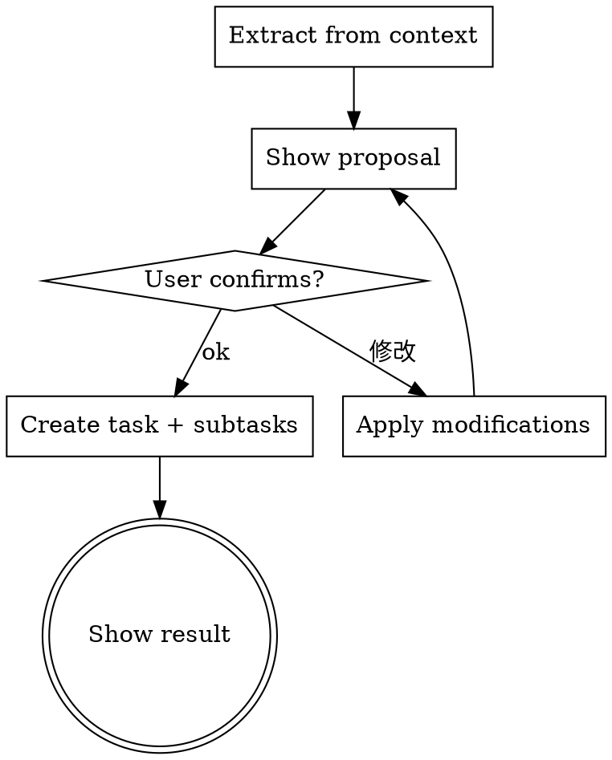

---
name: decompose-task
description: Use when a conversation has discussed a requirement, feature, or work item and the user wants to turn it into a structured Notion task with subtasks. Triggers on /decompose or when user says "拆解任务", "创建任务并拆子目标".
---

# Decompose Task

从当前对话上下文中提取任务，拆解为子目标，经用户确认后创建到 Notion。

## When to Use

- 对话中讨论了一个需求、功能或工作项，需要落地为 Notion 任务
- 用户输入 `/decompose`

**When NOT to use:**
- 对话中没有明确的任务需求 → 提示用户并终止
- 只需要创建任务不需要子目标 → 用 `/capture`

## Core Pattern

```
对话上下文 → AI 提取结构化提案 → 用户确认/修改循环 → 创建任务 + 子目标
```



## Implementation

### 1. 提取

从对话上下文中提取：

| 字段 | 规则 |
|------|------|
| 任务名称 | 简洁概括，不超过 20 字 |
| 项目 | 从对话推断，无法推断则留空 |
| 优先级 | 🔴 紧急 / 🟡 高 / 🟢 普通，根据语气和紧急程度判断 |
| 截止日期 | 对话中提到的时间线，无则留空 |
| 子目标 | 3-7 个，含名称 + 优先级，按执行顺序排列 |

子目标粒度：请按功能粒度进行拆解，确保各项子目标具体可执行，杜绝模糊描述。需注意：功能的完整生命周期（含设计、实现、验证等环节）应作为一个整体子目标，无需再将其拆分为更细的子任务。

### 2. 展示提案

```
📋 任务拆解提案

任务：{name}
项目：{project}
优先级：{priority}
截止：{due_date}

子目标：
  1. {subtask_name} ({priority})
  2. {subtask_name} ({priority})
  ...

请确认，或告诉我需要修改什么。
```

### 3. 修改循环

用户可用自然语言修改，每次修改后重新展示完整提案：
- "把第三个删掉"
- "优先级改为紧急"
- "加一个子目标：编写单元测试"
- "项目改成 XX"

等待用户说"ok"/"确认"/"可以"等肯定词。

### 4. 创建

用户确认后：
1. 调用 `create_task(name, project, priority, due_date)` 创建任务
2. 调用 `update_subtasks(task_id, subtasks)` 写入子目标
3. 展示结果：

```
✅ 已创建任务：{name}
🔗 {notion_url}

已添加 {n} 个子目标。可用 /status {task_id} doing {子目标名} 开始工作。
```

## Common Mistakes

| 错误 | 正确做法 |
|------|----------|
| 子目标过于模糊（如"完善功能"） | 用具体动作描述（如"实现 JWT 签发逻辑"） |
| 拆解过细（>7个子目标） | 合并相关项，保持 3-7 个 |
| 未等用户确认就创建 | 必须等明确肯定词 |
| 对话无任务信息时强行提取 | 提示"当前对话中未找到明确的任务需求"并终止 |
